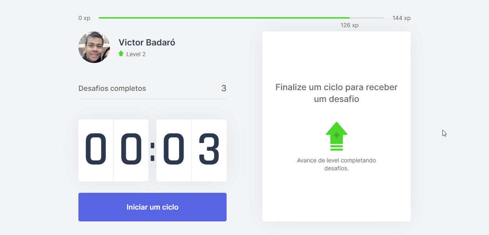
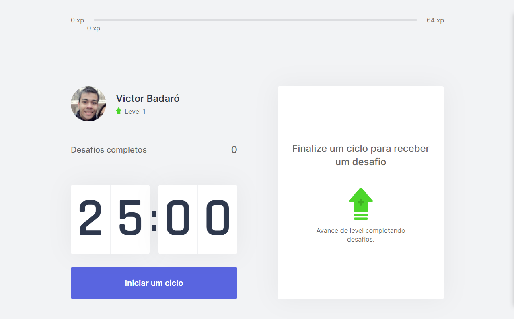
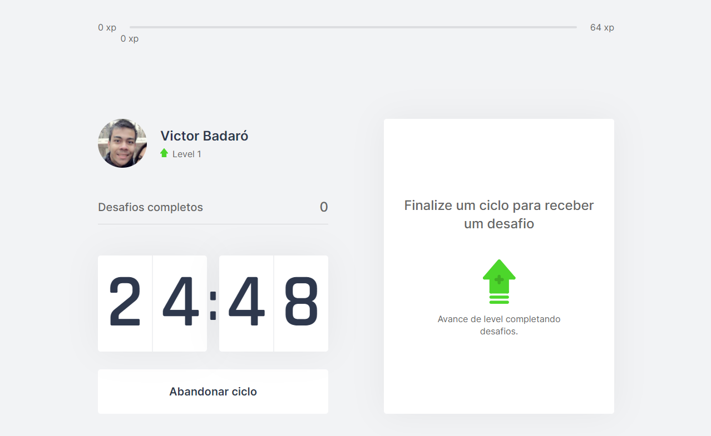
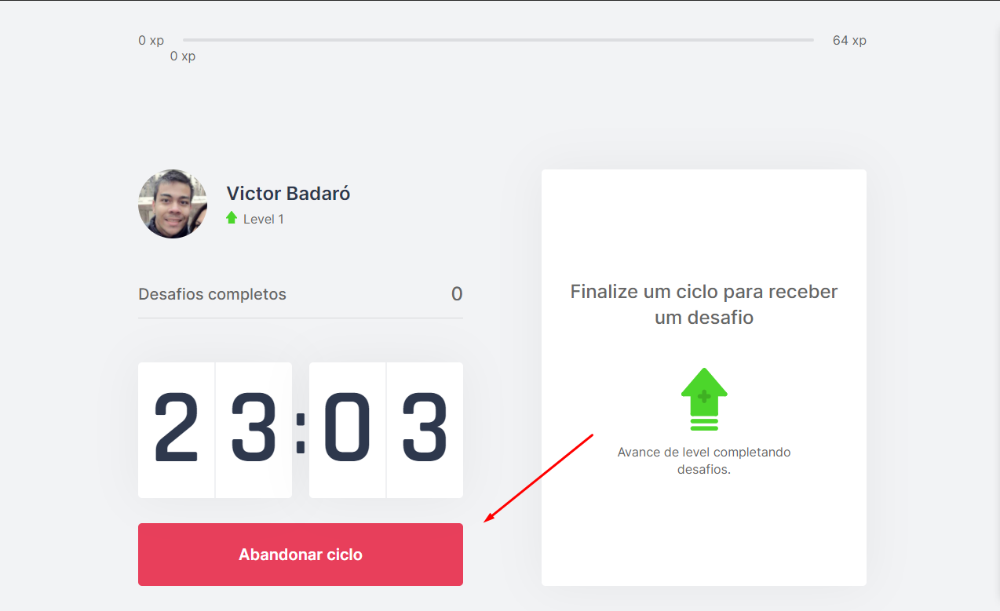
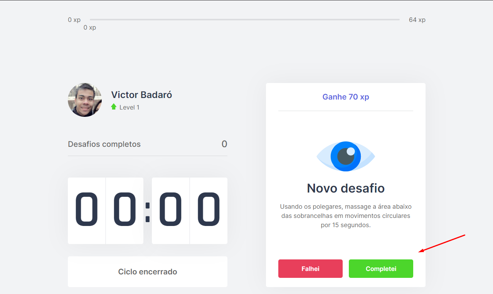
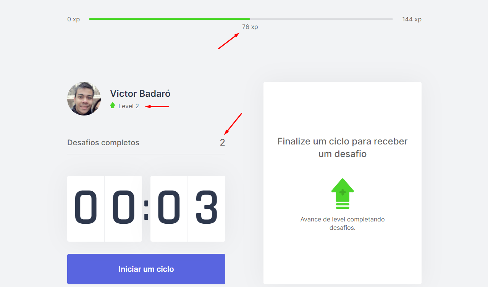
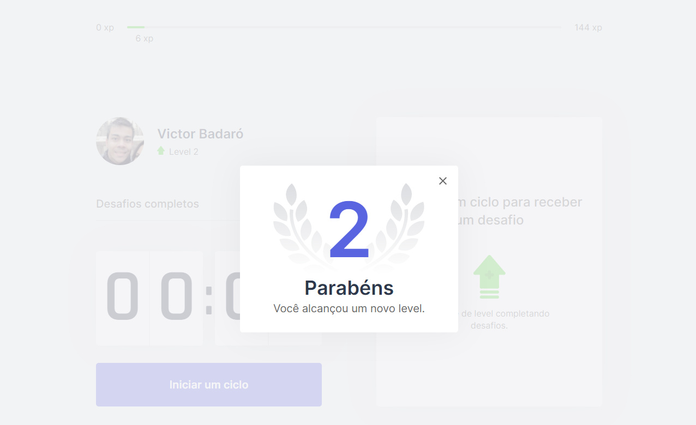

<h1>
    
    Move It
</h1>

<h1 align="center">
    
</h1>

[](./README.md)

## Índice

* [Sobre o projeto](#-sobre-o-projeto)
* [Tecnologias utilizadas](#-tecnologias-utilizadas)
* [Como baixar o projeto](#-como-baixar-o-projeto)
* [Como executar o projeto](#-como-executar-o-projeto)
* [Como usar o app](#-como-usar-o-app)
<br>

## 🧾 Sobre o projeto

Aplicação, no estilo [Pomodoro](https://pomofocus.io/), para desenvolvedores.
<br>

## 🚀 Tecnologias utilizadas

* [js-cookie](https://www.npmjs.com/package/js-cookie)
* [next](https://nextjs.org/)
* [react](https://reactjs.org/)
* [react-dom](https://www.npmjs.com/package/react-dom)
* [@types/js-cookie](https://www.npmjs.com/package/@types/js-cookie)
* [@types/node](https://www.npmjs.com/package/@types/node)
* [@types/react](https://www.npmjs.com/package/@types/react)
* [@types/react-dom](https://www.npmjs.com/package/@types/react-dom)
* [typescript](https://www.typescriptlang.org/)
<br>

## 🔽 Como baixar o projeto

```bash
$ git clone https://github.com/victorbadaro/moveit-next
```
<br>

## 💻 Como executar o projeto

Os comandos abaixo usam o gerenciador de pacotes [yarn](https://yarnpkg.com/)

```bash
# 1. Instale as dependências do projeto
$ yarn

# 2. Execute a aplicação
$ yarn dev
```

Se tudo for executado corretamente as seguintes mensagens serão apresentadas no terminal:
```bash
ready - started server on 0.0.0.0:3000, url: http://localhost:3000
event - compiled successfully
```

Agora basta abrir o navegador e acessar: http://localhost:3000

✅ Pronto! Se você seguiu corretamente os passos acima o projejto já estará sendo executado localmente em tua máquina.
<br>

## 👌 Como usar o app

* Clique em **_Iniciar um ciclo_** para começar
    

* Uma contagem regressiva de 25 minutos começará
    

* Você pode abandonar um ciclo clicando em **_Abandonar ciclo_**
    

* Após o ciclo ser encerrado (após a contagem regressiva de 25 minutos terminar) um **novo desafio** será apresentado na tela com os botões pra você informar se você completou ou não aquele desafio
    

* Clicando em **_Completei_** a experiência daquele desafio completado será contabilizada na experiencia total do usuário
    

* Completando a quantidade de experiencia necessária (indicada na **Experience Bar** no topo da página) o usuário irá subir de nível e uma mensagem será apresentada na tela
    

<br>

---
<p align="center">Desenvolvido com ❤ por <a href="https://github.com/victorbadaro">Victor Badaró</a></p>