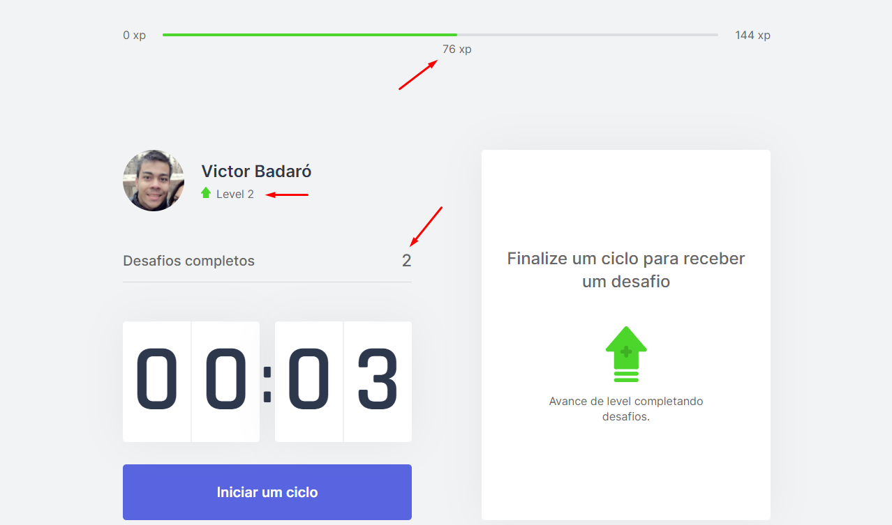

<h1>
    
    Move It
</h1>

<h1 align="center">
    
</h1>

[](./LEIAME.md)

## Summary

* [About](#-about)
* [Technologies](#-technologies)
* [How to download the project](#-how-to-download-the-project)
* [How to run the project](#-how-to-run-the-project)
* [How to use the app](#-how-to-use-the-app)
<br>

## 🧾 About

A [Pomodoro](https://pomofocus.io/) app for developers.
<br>

## 🚀 Technologies

* [js-cookie](https://www.npmjs.com/package/js-cookie)
* [next](https://nextjs.org/)
* [react](https://reactjs.org/)
* [react-dom](https://www.npmjs.com/package/react-dom)
* [@types/js-cookie](https://www.npmjs.com/package/@types/js-cookie)
* [@types/node](https://www.npmjs.com/package/@types/node)
* [@types/react](https://www.npmjs.com/package/@types/react)
* [@types/react-dom](https://www.npmjs.com/package/@types/react-dom)
* [typescript](https://www.typescriptlang.org/)
<br>

## 🔽 How to download the project

```bash
$ git clone https://github.com/victorbadaro/moveit-next
```
<br>

## 💻 How to run the project

The commands below use the [yarn](https://yarnpkg.com/) package manager.

```bash
# 1. Install all the project dependencies
$ yarn

# 2. Run the app
$ yarn dev
```

If everything runs correctly, the following message will be displayed on your terminal:
```bash
ready - started server on 0.0.0.0:3000, url: http://localhost:3000
event - compiled successfully
```

After that open your browser and access: http://localhost:3000

✅ Nice! If you followed all the steps above correctly the project will be running locally on your machine already.
<br>

## 👌 How to use the app

* Click in **_Iniciar um ciclo_** to start
    

* A 25-minute countdown will start
    

* You can left a cycle by clicking in **_Abandonar ciclo_**
    

* After the cycle is ended (after the 25-minute countdown ends) a **new challenge** will be shown on the screen with some buttons to you inform if you completed or not that challenge
    

* By clicking in **_Completei_** the experience of that completed challenge will be accounted for the user experience
    

* By completing the necessary experience (indicated on the **Experience Bar** at the top of the page) the user will level up and a message will be shown on the screen
    

<br>

---
<p align="center">Developed with ❤ by <a href="https://github.com/victorbadaro">Victor Badaró</a></p>